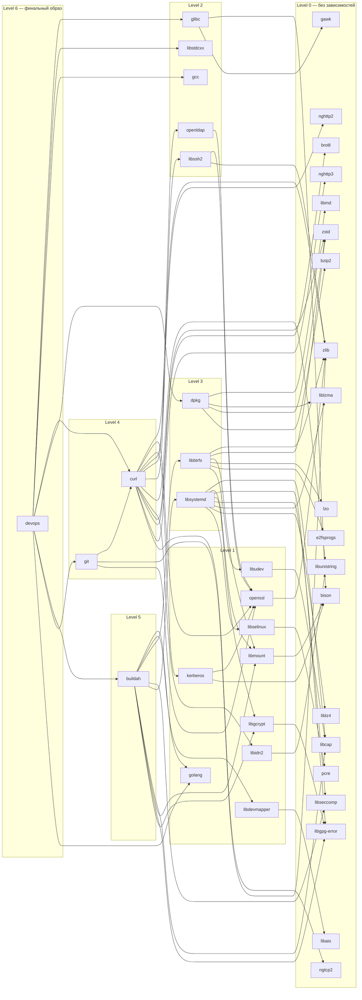
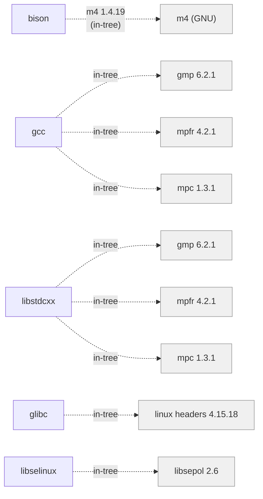

# Граф зависимостей сборки

Схема зависимостей между проектами и порядок сборки.

**Обозначения:**
- **Сплошная стрелка** `A --> B` — A зависит от B (`_DEPS`, `artifacts/deps/`)
- **Пунктирная стрелка** `A -.-> B` — in-tree зависимость (`_EXTRA_SRC_FILES`)
- Проекты сгруппированы по уровням: Level 0 собирается первым, Level 6 — последним

## Граф зависимостей



## In-tree зависимости (не показаны на графе)

Эти зависимости скачиваются как исходники и компилируются внутри основного проекта, без отдельного Docker-образа:



## Порядок сборки

### Level 0 — без зависимостей от других проектов

Эти проекты можно собирать параллельно, в любом порядке.

| Проект | Версии | apt-зависимости | In-tree src |
|--------|--------|-----------------|-------------|
| **zlib** | 1.3.1 | build-essential | — |
| **libmd** | 1.1.0 | build-essential, xz-utils, pkg-config | — |
| **libcap** | 2.25 | build-essential, xz-utils | — |
| **libgpg-error** | 1.35 | build-essential | — |
| **libseccomp** | 2.5.5 | build-essential, gperf, pkg-config | — |
| **liblzma** | 5.2.2 | build-essential | — |
| **liblz4** | 1.9.3 | build-essential | — |
| **nghttp2** | 1.58.0 | build-essential, pkg-config, autoconf, automake, libtool | — |
| **libunistring** | 1.1 | build-essential | — |
| **zstd** | 1.5.5 | build-essential | — |
| **brotli** | 1.1.0 | build-essential, cmake | — |
| **nghttp3** | 1.1.0 | build-essential, pkg-config, autoconf, automake, libtool | — |
| **ngtcp2** | 1.2.0 | build-essential, pkg-config, autoconf, automake, libtool | — |
| **bzip2** | 1.0.8 | build-essential | — |
| **libaio** | 0.3.113 | build-essential | — |
| **lzo** | 2.10 | build-essential | — |
| **e2fsprogs** | 1.47.0 | build-essential, pkg-config | — |
| **pcre** | 8.45 | build-essential | — |
| **bison** | 3.8.2 | build-essential | m4 1.4.19 |
| **gawk** | 5.2.2 | build-essential | — |

### Level 1 — зависят от Level 0

| Проект | Версии | Зависимости (проекты) | apt-зависимости | In-tree src |
|--------|--------|----------------------|-----------------|-------------|
| **openssl** | 1.1.1w | zlib | build-essential, perl | — |
| **libgcrypt** | 1.7.6 | libgpg-error | build-essential | — |
| **libidn2** | 2.3.4 | libunistring | build-essential, pkg-config | — |
| **libdevmapper** | 2.03.25 | libaio | build-essential, pkg-config | — |
| **libselinux** | 2.6 | pcre | build-essential, pkg-config, flex | libsepol 2.6 |
| **libudev** | 241 | libcap | build-essential, meson, ninja-build, pkg-config, gperf, m4, python3, python3-jinja2, gettext | — |
| **libmount** | 2.30.2 | bison | build-essential, autoconf, automake, autopoint, libtool, gettext, pkg-config | — |
| **kerberos** | 1.20.1 | openssl, bison | build-essential, pkg-config | — |
| **golang** | 1.4 → 1.17.13 → 1.20.6 → 1.22.6 → 1.24.5 | — (bootstrap chain) | build-essential | — |

> **golang** собирается как bootstrap chain: каждая версия компилируется предыдущей.
> `1.4` (из исходников на C) → `1.17.13` → `1.20.6` → `1.22.6` → `1.24.5`

### Level 2 — зависят от Level 0 + Level 1

| Проект | Версии | Зависимости (проекты) | apt-зависимости | In-tree src |
|--------|--------|----------------------|-----------------|-------------|
| **libssh2** | 1.11.0 | openssl, zlib | build-essential, pkg-config, autoconf, automake, libtool | — |
| **openldap** | 2.6.6 | openssl | build-essential, groff-base | — |
| **glibc** | 2.28–2.35 | bison, gawk | build-essential, python3 | linux headers 4.15.18 |
| **gcc** | 8.5.0–14.2.0 | — | build-essential, flex, texinfo, file | gmp 6.2.1, mpfr 4.2.1, mpc 1.3.1 |
| **libstdcxx** | 8.5.0 | — | build-essential | gmp 6.2.1, mpfr 4.2.1, mpc 1.3.1 |

### Level 3 — зависят от Level 0 + Level 1 + Level 2

| Проект | Версии | Зависимости (проекты) |
|--------|--------|----------------------|
| **libsystemd** | 241, 244, 255 | libcap, libmount, libgpg-error, libgcrypt, libseccomp, liblzma, liblz4, libselinux |
| **libbtrfs** | 6.6.3 | zlib, zstd, libmount, lzo, e2fsprogs, libudev |
| **dpkg** | 1.23.5 | libmd, liblzma, zstd, bzip2 |

### Level 4

| Проект | Версии | Зависимости (проекты) |
|--------|--------|----------------------|
| **curl** | 8.4.0 | zlib, openssl, kerberos, nghttp2, openldap, libssh2, libunistring, libidn2, zstd, brotli, nghttp3, ngtcp2 |
| **git** | 2.42.0 | curl, zlib, openssl |

### Level 5

| Проект | Версии | Зависимости (проекты) |
|--------|--------|----------------------|
| **buildah** | 1.38.0, 1.42.0, 1.43.0 | golang, libdevmapper, libbtrfs, libseccomp, libsystemd + транзитивные: libcap, libmount, libgpg-error, libgcrypt |

### Level 6 — финальный образ

| Проект | Версии | Зависимости (проекты) |
|--------|--------|----------------------|
| **devops** | profile-based | glibc, libstdcxx, gcc (COPY --from), dpkg, buildah, git, golang (artifacts/deps/), curl + 12 runtime deps (curl-bundle) |

## Детализация проектов

### bison `3.8.2`

```
versions/3.8.2.mk:
  M4_VERSION := 1.4.19
```

Сборка:
```bash
make -C bison docker/image 3.8.2    # или buildah/image
```

### gawk `5.2.2`

Нет зависимостей. Сборка:
```bash
make -C gawk docker/image 5.2.2
```

### openssl `1.1.1w`

```
versions/1.1.1w.mk:
  ZLIB_VERSION := 1.3.1
```

Сборка:
```bash
make -C zlib docker/image 1.3.1      # сначала зависимость
make -C openssl docker/image 1.1.1w
```

### kerberos `1.20.1`

```
versions/1.20.1.mk:
  OPENSSL_VERSION := 1.1.1w
  BISON_VERSION   := 3.8.2
```

### libselinux `2.6`

```
versions/2.6.mk:
  SEPOL_VERSION := 2.6       # in-tree src
  PCRE_VERSION  := 8.45      # _DEPS
```

### libsystemd `241` / `244` / `255`

Все три версии используют одинаковые зависимости:

```
versions/241.mk (= 244.mk = 255.mk):
  LIBCAP_VERSION     := 2.25
  LIBMOUNT_VERSION   := 2.30.2
  GPG_ERROR_VERSION  := 1.35
  GCRYPT_VERSION     := 1.7.6
  SECCOMP_VERSION    := 2.5.5
  LZMA_VERSION       := 5.2.2
  LZ4_VERSION        := 1.9.3
  SELINUX_VERSION    := 2.6
```

> v255 требует meson >= 0.60.0 (pip3 install meson)

### libbtrfs `6.6.3`

```
versions/6.6.3.mk:
  ZLIB_VERSION      := 1.3.1
  ZSTD_VERSION      := 1.5.5
  LIBMOUNT_VERSION  := 2.30.2
  LZO_VERSION       := 2.10
  E2FSPROGS_VERSION := 1.47.0
  LIBUDEV_VERSION   := 241
```

### dpkg `1.23.5`

```
versions/1.23.5.mk:
  LIBMD_VERSION  := 1.1.0
  LZMA_VERSION   := 5.2.2
  ZSTD_VERSION   := 1.5.5
  BZIP2_VERSION  := 1.0.8
```

### curl `8.4.0`

```
versions/8.4.0.mk:
  ZLIB_VERSION         := 1.3.1
  OPENSSL_VERSION      := 1.1.1w
  KERBEROS_VERSION     := 1.20.1
  NGHTTP2_VERSION      := 1.58.0
  OPENLDAP_VERSION     := 2.6.6
  LIBSSH2_VERSION      := 1.11.0
  LIBUNISTRING_VERSION := 1.1
  LIBIDN2_VERSION      := 2.3.4
  ZSTD_VERSION         := 1.5.5
  BROTLI_VERSION       := 1.1.0
  NGHTTP3_VERSION      := 1.1.0
  NGTCP2_VERSION       := 1.2.0
```

### git `2.42.0`

```
versions/2.42.0.mk:
  ZLIB_VERSION         := 1.3.1
  OPENSSL_VERSION      := 1.1.1w
  KERBEROS_VERSION     := 1.20.1
  NGHTTP2_VERSION      := 1.58.0
  OPENLDAP_VERSION     := 2.6.6
  LIBSSH2_VERSION      := 1.11.0
  LIBUNISTRING_VERSION := 1.1
  LIBIDN2_VERSION      := 2.3.4
  ZSTD_VERSION         := 1.5.5
  BROTLI_VERSION       := 1.1.0
  NGHTTP3_VERSION      := 1.1.0
  NGTCP2_VERSION       := 1.2.0
```

> Транзитивные версии curl-зависимостей резолвятся через `mk/resolve.mk`.

### gcc `8.5.0` – `14.2.0`

Все версии используют одинаковые in-tree зависимости:

```
versions/*.mk (все 7 версий):
  GMP_VERSION  := 6.2.1
  MPFR_VERSION := 4.2.1
  MPC_VERSION  := 1.3.1
```

Доступные версии: `8.5.0`, `9.5.0`, `10.5.0`, `11.4.0`, `12.3.0`, `13.2.0`, `14.2.0`

### glibc `2.28` – `2.35`

```
versions/*.mk (все 8 версий):
  KERNEL_VERSION := 4.15.18
```

Доступные версии: `2.28`, `2.29`, `2.30`, `2.31`, `2.32`, `2.33`, `2.34`, `2.35`

### golang (bootstrap chain)

```
versions/1.17.13.mk:  BOOTSTRAP_VERSION := 1.4
versions/1.20.6.mk:   BOOTSTRAP_VERSION := 1.17.13
versions/1.22.6.mk:   BOOTSTRAP_VERSION := 1.20.6
versions/1.24.5.mk:   BOOTSTRAP_VERSION := 1.22.6
```

Полная сборка (последовательно):
```bash
make -C golang docker/image 1.4
make -C golang docker/image 1.17.13
make -C golang docker/image 1.20.6
make -C golang docker/image 1.22.6
make -C golang docker/image 1.24.5
```

### buildah `1.38.0`

```
versions/1.38.0.mk:
  GO_VERSION         := 1.22.6
  DEVMAPPER_VERSION  := 2.03.25
  BTRFS_VERSION      := 6.6.3
  SYSTEMD_VERSION    := 241
```

Транзитивные зависимости (автоматически резолвятся через `mk/resolve.mk`):
- libseccomp, libcap, libmount, libgpg-error, libgcrypt — из `libsystemd/versions/241.mk`

### buildah `1.42.0` / `1.43.0`

```
versions/1.42.0.mk (= 1.43.0.mk):
  GO_VERSION         := 1.24.5
  DEVMAPPER_VERSION  := 2.03.25
  BTRFS_VERSION      := 6.6.3
  SYSTEMD_VERSION    := 241
```

## Матрица версий: devops/full (profile v3)

Полное дерево зависимостей с конкретными версиями для профиля `full`:

```
devops-astra:full-v3
├── glibc 2.28                          (COPY --from, runtime + dev)
│   ├── [deps] bison 3.8.2
│   │   └── [in-tree] m4 1.4.19
│   ├── [deps] gawk 5.2.2
│   └── [in-tree] linux headers 4.15.18
├── libstdcxx 8.5.0                     (COPY --from, C++ runtime)
│   └── [in-tree] gmp 6.2.1, mpfr 4.2.1, mpc 1.3.1
├── gcc 8.5.0                           (COPY --from, компилятор)
│   └── [in-tree] gmp 6.2.1, mpfr 4.2.1, mpc 1.3.1
├── curl 8.4.0                          (curl-bundle, CLI + shared libs)
│   ├── zlib 1.3.1
│   ├── openssl 1.1.1w
│   │   └── zlib 1.3.1
│   ├── kerberos 1.20.1
│   │   ├── openssl 1.1.1w
│   │   └── bison 3.8.2
│   ├── nghttp2 1.58.0
│   ├── openldap 2.6.6
│   │   └── openssl 1.1.1w
│   ├── libssh2 1.11.0
│   │   ├── openssl 1.1.1w
│   │   └── zlib 1.3.1
│   ├── libunistring 1.1
│   ├── libidn2 2.3.4
│   │   └── libunistring 1.1
│   ├── zstd 1.5.5
│   ├── brotli 1.1.0
│   ├── nghttp3 1.1.0
│   └── ngtcp2 1.2.0
├── dpkg 1.23.5                         (artifacts/deps/)
│   ├── libmd 1.1.0
│   ├── liblzma 5.2.2
│   ├── zstd 1.5.5
│   └── bzip2 1.0.8
├── buildah 1.38.0                      (artifacts/deps/)
│   ├── golang 1.22.6
│   │   └── bootstrap: 1.4 → 1.17.13 → 1.20.6 → 1.22.6
│   ├── libdevmapper 2.03.25
│   │   └── libaio 0.3.113
│   ├── libbtrfs 6.6.3
│   │   ├── zlib 1.3.1
│   │   ├── zstd 1.5.5
│   │   ├── libmount 2.30.2
│   │   │   └── bison 3.8.2
│   │   ├── lzo 2.10
│   │   ├── e2fsprogs 1.47.0
│   │   └── libudev 241
│   │       └── libcap 2.25
│   ├── libseccomp 2.5.5
│   ├── libsystemd 241
│   │   ├── libcap 2.25
│   │   ├── libmount 2.30.2
│   │   ├── libgpg-error 1.35
│   │   ├── libgcrypt 1.7.6
│   │   │   └── libgpg-error 1.35
│   │   ├── libseccomp 2.5.5
│   │   ├── liblzma 5.2.2
│   │   ├── liblz4 1.9.3
│   │   └── libselinux 2.6
│   │       ├── pcre 8.45
│   │       └── [in-tree] libsepol 2.6
│   ├── libcap 2.25                    (resolved)
│   ├── libmount 2.30.2               (resolved)
│   ├── libgpg-error 1.35             (resolved)
│   └── libgcrypt 1.7.6               (resolved)
├── git 2.42.0                          (artifacts/deps/)
│   ├── curl 8.4.0 (+ все deps curl)
│   ├── zlib 1.3.1
│   └── openssl 1.1.1w
└── golang 1.24.5                       (artifacts/deps/)
    └── bootstrap: 1.4 → 1.17.13 → 1.20.6 → 1.22.6 → 1.24.5
```

## Полная последовательность сборки для devops/full

```bash
# === Level 0 (параллельно) ===
make -C zlib         docker/image 1.3.1
make -C libmd        docker/image 1.1.0
make -C libcap       docker/image 2.25
make -C libgpg-error docker/image 1.35
make -C libseccomp   docker/image 2.5.5
make -C liblzma      docker/image 5.2.2
make -C liblz4       docker/image 1.9.3
make -C nghttp2      docker/image 1.58.0
make -C libunistring docker/image 1.1
make -C zstd         docker/image 1.5.5
make -C brotli       docker/image 1.1.0
make -C nghttp3      docker/image 1.1.0
make -C ngtcp2       docker/image 1.2.0
make -C bzip2        docker/image 1.0.8
make -C libaio       docker/image 0.3.113
make -C lzo          docker/image 2.10
make -C e2fsprogs    docker/image 1.47.0
make -C pcre         docker/image 8.45
make -C bison        docker/image 3.8.2
make -C gawk         docker/image 5.2.2

# === Level 1 (параллельно, после Level 0) ===
make -C openssl      docker/image 1.1.1w
make -C libgcrypt    docker/image 1.7.6
make -C libidn2      docker/image 2.3.4
make -C libdevmapper docker/image 2.03.25
make -C libselinux   docker/image 2.6
make -C libudev      docker/image 241
make -C libmount     docker/image 2.30.2
make -C kerberos     docker/image 1.20.1
make -C golang       docker/image 1.4        # bootstrap start

# === Level 1.5 (golang bootstrap, последовательно) ===
make -C golang       docker/image 1.17.13
make -C golang       docker/image 1.20.6
make -C golang       docker/image 1.22.6
make -C golang       docker/image 1.24.5

# === Level 2 (параллельно, после Level 1) ===
make -C libssh2      docker/image 1.11.0
make -C openldap     docker/image 2.6.6
make -C glibc        docker/image 2.28
make -C gcc          docker/image 8.5.0
make -C libstdcxx    docker/image 8.5.0

# === Level 3 (параллельно, после Level 2) ===
make -C libsystemd   docker/image 241
make -C libbtrfs     docker/image 6.6.3
make -C dpkg         docker/image 1.23.5

# === Level 4 (после Level 3) ===
make -C curl         docker/image 8.4.0
# git после curl:
make -C git          docker/image 2.42.0

# === Level 5 (после Level 4) ===
make -C buildah      docker/image 1.38.0

# === Level 6 (финальная сборка) ===
make -C devops       docker/deps full
make -C devops       docker/image full
```
